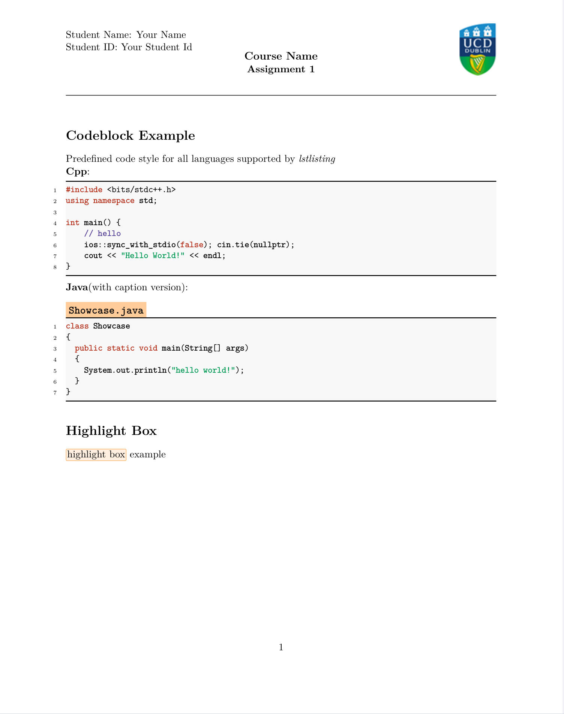

# Latex Assignment Template (Class)

A latex assignment template for Software Engineering Student

## Preview



[preview pdf](main.pdf)  

## Feature

- concise  
no excessive extra package imported in the class file, you can manage your package with comfort  

- makes your tex file tidy  
use class, not `tex` file template, which makes your `main.tex` file tidy.  

- easy to make your own template based on it

## Download

[assignment.cls](https://github.com/Ziqi-Yang/latex_assignment_template/releases/download/v1.0.0/assignment.cls)


## Usage

Just put `assignment.cls` file into your latex workspace root.  

First define your document class as `assignment`:  

``` latex
\documentclass{assignment}
```

Then use `assignmentTitle` command to create a banner for your assignment  

``` latex
\begin{document}
\assignmentTitle{Your Name}{Your Student Id}{logo image path}{Course Name}{Assignment 1}
% ...
\end{document}
```

One simple example is the [main.tex](main.tex) document


## Predefined Commands

- `assignmentTitle`:  
used to create a banner at the top  
usage: `\assignmentTitle{Your Name}{Your Student Id}{logo.png}{Course Name}{Assignment 1}`

- `hword`:  
highlight words or phrase in a box  
usage: `\hword{highlight word box}`

## Predefined Style

- Predefined `lstinputlisting` and `lstlisting` style for all (programming) languages recognized by `lstlisting` package.  

## Thanks

- [uofa-eng-assignment](https://github.com/bshramin/uofa-eng-assignment)
